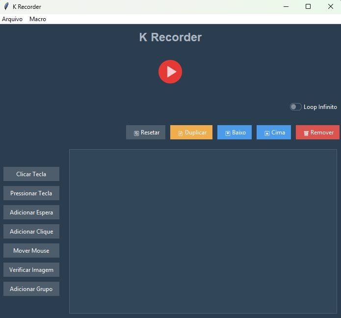
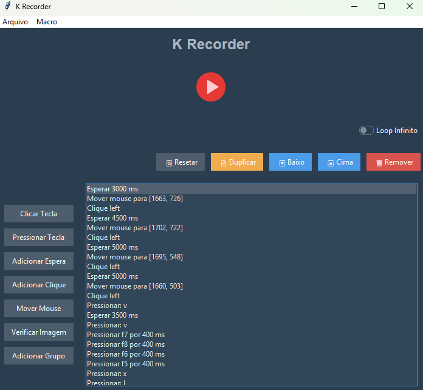

## 🖱️ Macro Recorder com Interface Gráfica

Este é um gravador de macro feito em Python com suporte a interface gráfica (GUI) que permite automatizar interações no sistema como cliques, movimentos do mouse, teclas pressionadas, esperas e verificação de imagem na tela usando OpenCV.

## 🖼️ Exemplo da Interface

Abaixo está uma prévia da interface gráfica do Macro Recorder:

<p align="center">
  
  
</p>

## 📦 Funcionalidades

    - Gravação e execução de sequências de ações.

    - Suporte a:

        - Cliques e movimentos do mouse.

        - Pressionar e segurar teclas.

        - Combinações de teclas (Ctrl+C, Alt+Tab, etc).

        - Esperas temporizadas.

        - Verificação de imagem na tela com OpenCV.

    - Execução contínua com opção de loop.

    - Interface amigável construída com ttkbootstrap.

    - Atalhos globais:

        - F5 — Iniciar execução.

        - F6 — Parar execução.

    - Possibilidade de agrupar ações e pular grupos caso uma imagem esperada não seja encontrada.

## 🧰 Tecnologias utilizadas

    Python 3.x

    ttkbootstrap

    PyAutoGUI

    Pynput

    OpenCV

    Pillow

    Keyboard

## 🚀 Como executar o projeto

1. Clone o repositório:
```bash
git clone https://github.com/seu-usuario/seu-repo.git
cd seu-repo
```
2. Instale as dependências:
```bash
pip install -r requirements.txt
```
3. Execute a aplicação:
```bash
python main.py
```
## 📁 Estrutura do projeto
```bash
├── .gitignore
├── gui.py
├── command.py
├── action.py
├── main.spec
├── overlay_selection.py
├── qt_core.py
├── main.py                  # Script principal
├── README.md                # Este arquivo
└── requirements.txt         # Dependências do projeto
```
## 📷 Verificação de imagem com OpenCV

A ação image_check permite que o macro pause e verifique se uma imagem específica está presente na tela. Caso não seja encontrada, o macro pode pular a próxima ação ou grupo de ações.
## 📌 Observações

    O programa deve ser executado com permissões de administrador no Windows para capturar corretamente os atalhos globais.

    É possível adicionar novas ações ou personalizar o comportamento no código-fonte.

## 🧑‍💻 Autor

Kevin Lami
